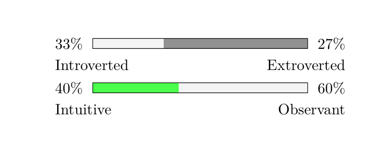

# MBTI16PersonalitesLaTeX
This package for LaTeX is used to generate the personalty type gauges found on 16personalties.com (not affiliated) in a LaTeX document.

# How to use
To use the package `\usepackage{MBTI16P}`.
First add this package inside your LaTeX package using submodule:

``` bash
$ git submodule add https://github.com/byteofsoren/MBTI16PersonalitesLaTeX.git  texmf/tex/latex/MBTI16PersonalitesLaTeX
```
Or if you are not tracking your project with git (You should) add it by just cloning it in to the same directory

And then at the moment there is only two commands `\trait` and `\colortrait`.
Those two generate a trait bar like on the 16 personalties web site.
The arguments for both follow the same structure:

``` tex
\trait{Introverted}{33}{Extroverted}{27}
\colortrait{Intuitive}{40}{Observant}{60}{green!70}
```
Expected result:



The first and third argument is the two traits and the second and third is the percentage of the preceding trait.
The last argument on `\colortrait` is used if you want to set none standard color on your trait.
Note that the color is set to your dominant trait for that bar and not to the secondary trait.

# Configurations
The MBT16P package has the following configuration options:

| Parameter | Explanation                    | Default value |
|-----------|--------------------------------|---------------|
| bgcolor   | Color of the suppressed trait. | gray!10       |
| fgcolor   | Color of the dominant trait.   | gray          |
| barwidth  | The length of the bar.         | 4cm           |
| barheight | The height of the bar          | 2mm           |

To change any of the default values use the `\pgfkeys` command.
For example:

``` tex
\pgfkeys{/MBTI16P/.cd, barwidth=5cm}
```
This changes the bar `barwidth` to 5cm.


